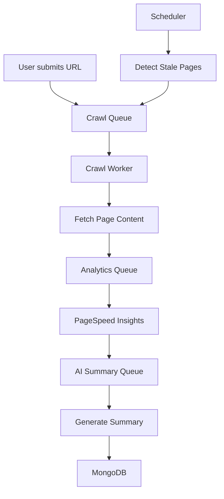

````markdown
# AI-Powered SEO Crawler & Summarization Engine

An intelligent distributed web crawler and SEO analysis platform that automatically crawls websites, collects performance metrics using Google PageSpeed Insights, generates AI-powered summaries, and maintains fresh analytics through a multi-queue worker architecture.

Built to solve the challenge of continuous SEO monitoring in a fast-changing web environment.

---

## ✨ Features

- **Intelligent Web Crawling**
  - Domain-aware crawling
  - Respectful rate limiting
  - URL deduplication

- **Distributed Queue Architecture**
  - Separate queues for crawling, analytics, AI summarization, and recrawling
  - Powered by **BullMQ** + **Redis**

- **Google PageSpeed Insights Integration**
  - Performance Score
  - SEO Score
  - Accessibility Score
  - Best Practices Score

- **AI Content Summarization**
  - Generates human-readable summaries using NLP models (Hugging Face / Cohere / DeepSeek)

- **Smart Scheduler**
  - Automatically detects and re-queues stale pages
  - Ensures analytics stay fresh

- **Fault Tolerance**
  - Retry mechanisms
  - Dead-letter queues
  - Structured logging

- **Analytics Dashboard**
  - View crawl results, performance metrics, and AI summaries
  - Queue statistics
  - Export reports (CSV / PDF)

---

## 🛠️ Tech Stack

### Backend

- **Node.js** + **Express.js**
- **BullMQ** (Queue System)
- **Redis**
- **MongoDB** (Database)

### AI / NLP

- Hugging Face
- Cohere / DeepSeek (optional)

### APIs

- Google PageSpeed Insights API

### Frontend

- React.js

---

## 📁 Project Structure

```bash
seo-crawler-engine/
├── src/
│   ├── controllers/
│   │   ├── crawl.controller.ts
│   │   ├── analytics.controller.ts
│   │   └── aiSummary.controller.ts
│   ├── workers/
│   │   ├── crawl.worker.ts
│   │   ├── analytics.worker.ts
│   │   └── aiSummary.worker.ts
│   ├── queues/
│   │   ├── crawl.queue.ts
│   │   ├── analytics.queue.ts
│   │   └── summary.queue.ts
│   ├── scheduler/
│   │   └── stalePageScheduler.ts
│   ├── models/
│   │   ├── domainPage.model.ts
│   │   └── domainNode.model.ts
│   └── utils/
│       ├── rateLimiter.ts
│       ├── logger.ts
│       └── dbUtils.ts
├── dashboard/                  # React.js frontend
├── docker/
├── .env
├── package.json
└── README.md
```
````

---

## 🚀 Installation & Setup

### 1. Clone the Repository

```bash
git clone https://github.com/yourusername/seo-crawler-engine.git
cd seo-crawler-engine
```

### 2. Install Dependencies

```bash
npm install
```

### 3. Start Redis (Required for queues)

Using Docker (Recommended):

```bash
docker run -d -p 6379:6379 --name redis redis:alpine
```

Or install Redis locally.

### 4. Configure Environment Variables

Create a `.env` file in the root directory:

```env
PORT=5000

# MongoDB
MONGO_URI=mongodb://localhost:27017/seoCrawler

# Redis
REDIS_HOST=127.0.0.1
REDIS_PORT=6379

# Google PageSpeed Insights
PAGESPEED_API_KEY=your_google_pagespeed_api_key

# AI Provider (Hugging Face / Cohere)
AI_API_KEY=your_ai_provider_api_key
```

> **Note**: Get your PageSpeed API key from [Google PageSpeed Insights API](https://developers.google.com/speed/docs/insights/v5/get-started).

---

## 🏃‍♂️ Running the Project

You need to run **multiple services** in separate terminals:

### Terminal 1: Backend Server

```bash
npm run dev
```

### Terminal 2: Crawl Worker

```bash
npm run worker:crawl
```

### Terminal 3: Analytics Worker

```bash
npm run worker:analytics
```

### Terminal 4: AI Summary Worker

```bash
npm run worker:summary
```

### Terminal 5: Scheduler (Stale Page Recrawling)

```bash
npm run scheduler
```

---

## 📡 API Usage

### Submit a URL for Crawling

```http
POST /api/crawl
Content-Type: application/json
```

**Request Body:**

```json
{
  "url": "https://example.com"
}
```

**Response:**

```json
{
  "message": "URL added to crawl queue",
  "jobId": "12345"
}
```

The system will automatically:

1. Crawl the page
2. Fetch PageSpeed metrics
3. Generate AI summary
4. Store results in MongoDB

---

## 📊 Workflow



---

## 📈 Evaluation Metrics

- Task success rate
- Average queue processing time
- Retry rate
- Crawl throughput
- Summary quality & completeness

---

## 🎯 Learning Outcomes

This project demonstrates strong understanding of:

- Distributed system design
- Queue-based task orchestration (BullMQ + Redis)
- Rate-limited and respectful web crawling
- Background job processing
- Scheduler architecture
- AI integration in backend systems
- Fault-tolerant pipelines
- Full-stack development with modern tools

---

## 🔮 Future Improvements

- Keyword extraction and topic clustering
- Advanced composite SEO scoring
- Kubernetes-based horizontal scaling of workers
- Real-time dashboard with WebSocket updates
- User authentication & multi-domain management
- Visual site map and link graph

---

## 👨‍💻 Author

**Kartik Sundriyal**  
Final Year Computer Science Student

---

## 📜 License

This project is licensed under the **MIT License** — see the [LICENSE](LICENSE) file for details.

---

## ⭐ Show Your Support

If you found this project helpful, please give it a ⭐ on GitHub!

---

**Made with ❤️ for modern backend engineering & SEO intelligence**

```

---

**How to use this README:**

1. Copy the entire content above.
2. Create/replace your `README.md` file with it.
3. Update the GitHub username (`yourusername`) with your actual username.
4. Add a `LICENSE` file if you want (MIT is already mentioned).
```
